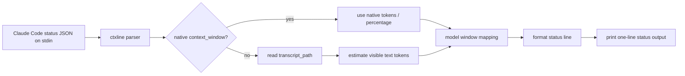

# ctxline architecture

ctxline is a standalone Zig command-line tool intended to run as a Claude Code `statusLine` command.

## System shape

## Stable contracts

- Input: JSON from stdin, normally Claude Code statusLine payload.
- Preferred native fields:
  - `model.display_name` or `model.id`
  - `context_window.used_percentage`
  - `context_window.total_input_tokens`
  - `context_window.total_output_tokens`
  - `context_window.context_window_size`
  - `transcript_path`
- Output: one line: `{model} │ ctx {pct}% │ {used}/{max} │ {bar}`.
- Fallback: malformed/missing status JSON prints `ctxline │ no status json` and exits cleanly.

## Model context defaults

- `deepseek-v4-pro[1m]`: 1,000,000 tokens
- `deepseek-v4-pro`: 1,000,000 tokens
- `deepseek-v4-flash`: 128,000 tokens
- `claude` + `1m`: 1,000,000 tokens
- unknown: 200,000 tokens

## Known constraints

- Transcript estimation is approximate and intentionally conservative.
- Transcript reads are bounded; oversized transcripts use the readable prefix and ignore partial trailing JSONL lines.
- The CLI should not depend on network or provider SDKs.
- The CLI never emits raw transcript payload in output.

## Implementation modules

- `src/main.zig`: stdin cap, error fallback, stdout line writing.
- `src/ctxline.zig`: public facade and `ContextUsage` orchestration.
- `src/status_json.zig`: dynamic `std.json.Value` extraction of model/context/transcript fields.
- `src/transcript.zig`: JSONL transcript fallback estimator.
- `src/models.zig`: model-to-context-window mapping.
- `src/format.zig`: token, percent, and Unicode bar formatting.
