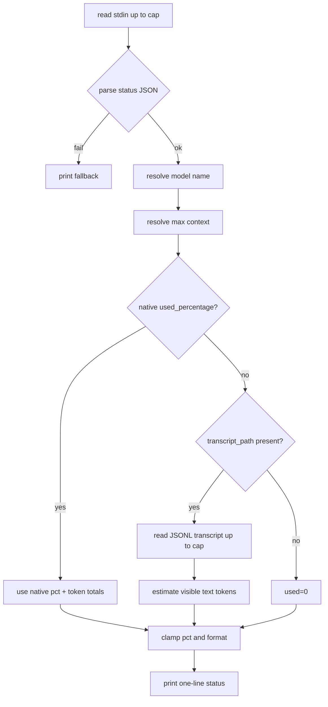

# ctxline MVP design

## 0. Terminology

- **status JSON**: the JSON object Claude Code passes to a statusLine command over stdin.
- **native context**: `context_window.*` fields in status JSON.
- **fallback estimate**: local token estimate derived from `transcript_path` when native context is missing.
- **model window**: max context token budget used to compute percent.
- **status line**: one-line output printed by ctxline.

## 1. Decisions and constraints

### Requirement summary

Build a public, standalone Zig CLI named `ctxline` that reads Claude Code statusLine JSON from stdin and prints a compact context usage line. It should prefer native `context_window.used_percentage` and token counts when present; otherwise read `transcript_path`, estimate tokens from transcript text, map the model to a max context window, and compute usage percentage.

### Explicit non-goals

- No network calls or provider SDK integration.
- No exact tokenizer dependency in MVP.
- No persistent cache in MVP; document it as future work.
- No secrets or raw transcript content in output.
- No shell wrapper required for normal macOS/Linux use.

### Complexity tier

Small standalone CLI, default complexity. Main risk is Zig stdlib compatibility and transcript JSON shape variability.

### Key decisions

- Implement parsing/estimation logic in a testable library module and keep `main.zig` thin.
- Support JSONL transcript lines and recursively count strings under user-visible keys (`content`, `text`, `tool_result`, `message`) while skipping metadata keys.
- Limit stdin and transcript reads to prevent statusLine hangs.
- Provide a GitHub Actions CI workflow that installs Zig and runs `zig build test`.

## 2. Nouns and orchestration

### 2.1 Noun layer: current → changes

Current: empty repo with CodeStable skeleton.

Changes:

- Add `StatusInput` / parsed root handling from stdin JSON.
- Add `ContextUsage` result containing model name, used tokens, max tokens, percentage, and mode (`native`, `transcript`, `fallback`).
- Add model window mapping for DeepSeek and Claude 1M cases.
- Add transcript estimator for JSONL lines.
- Add formatter for token counts and bar output.

Example native input:

```json
{"model":{"display_name":"deepseek-v4-pro[1m]"},"context_window":{"used_percentage":38.2,"total_input_tokens":380000,"total_output_tokens":2000,"context_window_size":1000000}}
```

Expected output contains:

```text
deepseek-v4-pro[1m] │ ctx 38.2% │ 382K/1.0M │
```

Example fallback input:

```json
{"model":{"id":"deepseek-v4-flash"},"transcript_path":"/absolute/path/to/transcript.jsonl"}
```

Expected behavior: estimate transcript tokens and divide by 128,000.

### 2.2 Orchestration layer: current → changes



Flow constraints:

- Parse errors must not crash the status line; print fallback.
- Missing transcript or unreadable transcript should produce zero estimate, not an exception line.
- Percent is clamped to `[0, 100]`.
- Formatting must be deterministic for tests.

### 2.3 Mount points / removability

- Binary target `ctxline` in `build.zig`.
- Library code under `src/ctxline.zig` and CLI entry `src/main.zig`.
- CI workflow `.github/workflows/ci.yml`.
- Documentation `README.md` with Claude Code settings example.

Removing these mount points removes the feature from the repo.

### 2.4 Implementation steps

1. Create Zig package skeleton and tests for model window/token formatting/native parsing.
2. Add transcript estimation tests and implementation.
3. Add CLI stdin/fallback behavior and smoke tests.
4. Add README, LICENSE, .gitignore, CI, and CodeStable acceptance docs.
5. Run local build/test/smoke verification and publish.

### 2.5 Structural health and micro-refactor

Repo is new and small; no pre-feature micro-refactor needed. Keep production logic in `src/ctxline.zig` to avoid a fat `main.zig`.

## 3. Acceptance contract

- S1 Native context: status JSON with `used_percentage`, total input/output tokens, and context size prints the native percentage and token totals.
- S2 Native percentage without token totals: used tokens are derived from percentage × max context.
- S3 Transcript fallback: status JSON without `context_window` but with `transcript_path` estimates visible transcript text and computes percentage using model mapping.
- S4 Model mapping: `deepseek-v4-pro[1m]` and `deepseek-v4-pro` map to 1,000,000; `deepseek-v4-flash` maps to 128,000; unknown maps to 200,000.
- S5 Malformed stdin JSON prints `ctxline │ no status json` and exits successfully.
- S6 Output is a single line and never prints raw transcript text.
- Reverse check: no network calls, no persistent cache in MVP, no hard dependency on Claude-only model names.

## 4. Architecture docs relationship

Update `.codestable/architecture/ARCHITECTURE.md` to describe the final CLI pipeline, stable input/output fields, model defaults, and known constraints.
